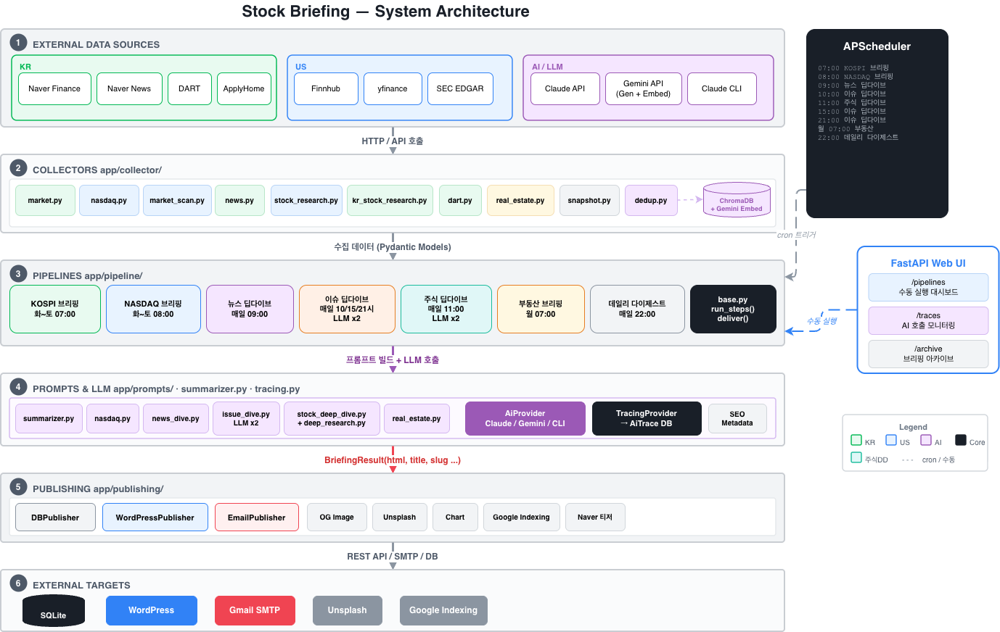

<p align="center">
  <strong>머니다이브</strong><br>
  AI가 매일 시장을 분석하고, 글을 쓰고, 발행까지 하는 자동화 금융 미디어
</p>

<p align="center">
  <a href="https://dailymoneydive.com">dailymoneydive.com</a>
</p>

---

## 서비스 소개

머니다이브는 **수집 → 분석 → 기사 작성 → 발행**까지 전 과정을 AI가 자동으로 수행하는 금융 콘텐츠 플랫폼이에요.

매일 7개 파이프라인이 자동 운영되며, 미국주식·한국주식·부동산·이슈 분석 기사를 WordPress 블로그에 발행하고 구독자에게 이메일로 전달합니다.

## 콘텐츠 라인업

| 콘텐츠 | 스케줄 | 설명 |
|--------|--------|------|
| **코스피 마감 브리핑** | 화~토 07:00 | 코스피·코스닥 마감, 수급 동향, 주요 공시 정리 |
| **나스닥 마감 브리핑** | 화~토 08:00 | 전일 나스닥·S&P·다우 마감 요약, 주요 종목 등락 분석 |
| **뉴스 딥다이브** | 매일 09:00 | 오늘의 핵심 뉴스 2~3개를 종합 분석 |
| **이슈 딥다이브** | 매일 10·15·21시 | 가장 중요한 이슈 1개를 6개 섹션으로 깊게 분석하는 피처 기사 (LLM x2) |
| **주식 딥다이브** | 매일 11:00 | AI가 종목 1개를 선정해 증권사 리포트 수준의 심층 분석 (LLM x2) |
| **부동산 브리핑** | 월 07:00 | 주간 부동산 뉴스 + 청약 일정 요약 |
| **데일리 다이제스트** | 매일 22:00 | 오늘 발행된 글 목록을 이메일 1통으로 정리 |

## 아키텍처



상세 설명은 **[docs/architecture.md](docs/architecture.md)** 참고.

## 기술 스택

| 분류 | 기술 |
|------|------|
| Runtime | Python 3.13, FastAPI, APScheduler |
| AI | Claude API, Claude CLI, Gemini (생성 + 임베딩) |
| 데이터 수집 (KR) | 네이버 금융, 네이버 뉴스, DART, 청약홈 |
| 데이터 수집 (US) | Finnhub, yfinance, SEC EDGAR |
| 중복 제거 | ChromaDB + Gemini 시맨틱 임베딩 |
| 발행 | WordPress REST API, Gmail SMTP, Google Indexing API |
| SEO | Rank Math 자동 설정, OG 이미지 생성, Unsplash 이미지 |
| 차트 | Matplotlib (주가 차트 자동 생성) |
| DB | SQLite + SQLAlchemy (async) |
| 인프라 | Oracle Cloud (ARM), systemd |

## 프로젝트 구조

```
app/
├── core/                       # 설정, DB, 모델
├── collector/                   # 데이터 수집 모듈
│   ├── market.py                #   네이버 금융 (코스피/코스닥 지수)
│   ├── nasdaq.py                #   Finnhub (나스닥/S&P/다우 + 관심 종목)
│   ├── market_scan.py           #   나스닥 100 스캔 + 매크로 지표 (VIX, 국채, DXY)
│   ├── news.py                  #   네이버 뉴스 검색 API
│   ├── dart.py                  #   DART 공시
│   ├── real_estate.py           #   청약홈 + 부동산 뉴스
│   ├── stock_research.py        #   US 종목 딥리서치 (Finnhub + yfinance + SEC)
│   ├── kr_stock_research.py     #   KR 종목 딥리서치 (네이버 금융 API)
│   ├── dedup.py                 #   ChromaDB + Gemini 시맨틱 중복 제거
│   └── snapshot.py              #   지수 스냅샷 DB 저장/조회
├── prompts/                     # LLM 프롬프트 + 호출
│   ├── nasdaq.py                #   나스닥 브리핑
│   ├── news_dive.py             #   뉴스 딥다이브
│   ├── issue_dive.py            #   이슈 딥다이브 (LLM x2)
│   ├── deep_research.py         #   US 종목 딥리서치
│   ├── stock_deep_dive.py       #   주식 딥다이브 (자동 종목 선정 + 기사 생성)
│   └── real_estate.py           #   부동산 브리핑
├── pipeline/                    # 파이프라인 오케스트레이션
│   ├── base.py                  #   공통 스텝 러너 + Publisher 패턴
│   ├── kospi.py                 #   코스피 브리핑
│   ├── nasdaq.py                #   나스닥 브리핑
│   ├── research.py              #   뉴스 딥다이브
│   ├── issue_dive.py            #   이슈 딥다이브
│   ├── stock_deep_dive.py       #   주식 딥다이브
│   ├── real_estate.py           #   부동산 브리핑
│   └── digest.py                #   데일리 다이제스트
├── publishing/                  # 발행 모듈
│   ├── wordpress.py             #   WordPress REST API 발행
│   ├── email_sender.py          #   이메일 발송 (Gmail SMTP)
│   ├── email_template.py        #   이메일 HTML 템플릿
│   ├── og_image.py              #   OG 이미지 생성 (Pillow)
│   ├── chart.py                 #   주가 차트 렌더링 (Matplotlib)
│   ├── unsplash.py              #   Unsplash 이미지 검색
│   └── google_indexing.py       #   Google 색인 요청
├── summarizer.py                # AI 프로바이더 + SEO 메타 추출
├── scheduler.py                 # APScheduler 스케줄 설정
└── tracing.py                   # AI 호출 트레이싱 → /traces 대시보드
```

## 실행

```bash
# 서버 시작 (스케줄러 포함)
./run.sh start

# 개별 파이프라인 수동 실행
python run_html_only.py              # 전체 파이프라인 HTML 생성
python -m app.research               # 딥리서치 실행
python -m app.research --ticker NVDA  # 특정 종목 딥리서치
```

## 발행 프로세스

1. **DB 저장** — 브리핑 결과를 SQLite에 저장 (같은 날 재실행 시 upsert)
2. **OG 이미지** — Pillow로 카테고리별 색상 + 제목 이미지 생성 → WordPress 업로드
3. **Unsplash** — LLM이 추출한 `image_keyword`로 관련 사진 검색 → 본문 상단 삽입
4. **WordPress** — REST API로 포스트 발행, Rank Math SEO 메타 자동 설정
5. **Google 색인** — 발행 즉시 Google Indexing API로 색인 요청
6. **이메일** — 활성 구독자에게 브리핑 이메일 발송
