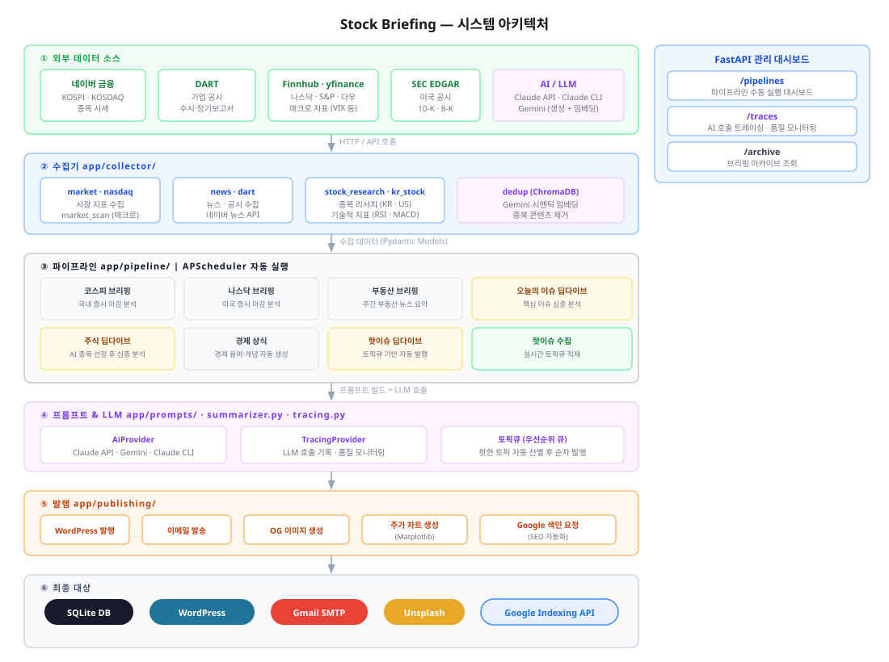

# 아키텍처

## 시스템 아키텍처

### 6-레이어 구조

| # | 레이어 | 역할 |
|---|--------|------|
| 1 | **외부 데이터 소스** | 네이버 금융(KOSPI·KOSDAQ·종목 시세), DART(기업 공시), Finnhub·yfinance(나스닥·S&P·다우, 매크로 지표), SEC EDGAR(미국 공시), AI/LLM(Claude API·Claude CLI·Gemini) |
| 2 | **수집기** `app/collector/` | market·nasdaq(시장 지표), news·dart(뉴스·공시), stock_research·kr_stock(종목 리서치 KR·US, RSI·MACD), dedup(ChromaDB + Gemini 시맨틱 임베딩으로 중복 제거) |
| 3 | **파이프라인** `app/pipeline/` | APScheduler 기반 자동 실행. 코스피 브리핑, 나스닥 브리핑, 부동산 브리핑, 이슈 딥다이브, 주식 딥다이브, 경제 상식, 핫이슈 딥다이브, 핫이슈 수집 |
| 4 | **프롬프트 & LLM** `app/prompts/` · `summarizer.py` · `tracing.py` | `AiProvider`가 Claude/Gemini/CLI를 추상화, `TracingProvider`가 모든 호출을 자동 기록, 토픽큐(우선순위 큐)로 핫한 토픽 자동 선별 후 순차 발행 |
| 5 | **발행** `app/publishing/` | WordPress 발행, 이메일 발송, OG 이미지 생성, 주가 차트 생성(Matplotlib), Google 색인 요청(SEO 자동화) |
| 6 | **최종 대상** | SQLite DB, WordPress, Gmail SMTP, Unsplash, Google Indexing API |

### FastAPI 관리 대시보드

| 엔드포인트 | 역할 |
|------------|------|
| **`/pipelines`** | 파이프라인 수동 실행 대시보드 |
| **`/traces`** | AI 호출 트레이싱 · 품질 모니터링 |
| **`/archive`** | 브리핑 아카이브 조회 |

상세 파이프라인 설명은 **[pipelines.md](./pipelines.md)** 참고.
