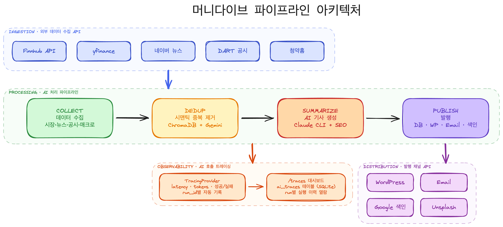
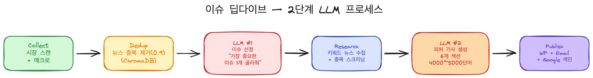

# 아키텍처

## 파이프라인 아키텍처



> [Excalidraw 원본](./pipeline-architecture.excalidraw)

### 레이어 구조

| 레이어 | 이름 | 역할 |
|--------|------|------|
| **INGESTION** | 외부 데이터 수집 API | Finnhub, yfinance, 네이버 뉴스, DART 공시, 청약홈 |
| **PROCESSING** | AI 처리 파이프라인 | Collect → Dedup → Summarize → Publish |
| **DISTRIBUTION** | 발행 채널 API | WordPress, Email, Google 색인, Unsplash |
| **OBSERVABILITY** | AI 호출 트레이싱 | TracingProvider → /traces 대시보드 |

### 처리 단계

```
COLLECT ──→ DEDUP ──→ SUMMARIZE ──→ PUBLISH
```

| 단계 | 설명 | 핵심 기술 |
|------|------|-----------|
| **Collect** | 5개 외부 API에서 시장 데이터·뉴스·공시 수집 | Finnhub, yfinance, 네이버 RSS, DART, 청약홈 |
| **Dedup** | 시맨틱 임베딩으로 중복 뉴스 제거 (유사도 0.9 이상) | ChromaDB + Gemini Embedding |
| **Summarize** | AI가 수집 데이터 기반으로 기사 생성 + SEO 메타 추출 | Claude CLI |
| **Publish** | DB 저장 → OG 이미지 → WordPress 발행 → 이메일 → 색인 | WordPress REST API, Gmail SMTP, Google Indexing API |

### 트레이싱 (Observability)

모든 AI 호출은 `TracingProvider`가 자동으로 감싸서 기록한다.

- **기록 항목**: latency_ms, input/output tokens, 성공/실패, 에러 메시지
- **그룹핑**: `run_id`로 파이프라인 실행 단위 추적
- **저장**: `ai_traces` 테이블 (SQLite, 동기 저장)
- **열람**: `/traces` 웹 대시보드에서 run별 실행 이력 확인

저장 실패해도 파이프라인은 멈추지 않는다 (fail-safe).

---

## 이슈 딥다이브 — 2단계 LLM 프로세스



> [Excalidraw 원본](./issue-dive-flow.excalidraw)

일반 파이프라인과 달리 **LLM을 2번** 호출하는 심층 분석 파이프라인.

```
Collect → Dedup → LLM #1 (이슈 선정) → Research → LLM #2 (기사 생성) → Publish
```

| 단계 | 설명 |
|------|------|
| **Collect** | `scan_market()` + `fetch_macro_indicators()` 재활용 |
| **Dedup** | 별도 컬렉션 `issue_dive_news`로 ChromaDB dedup |
| **LLM #1** | 전체 뉴스 중 가장 중요한 이슈 1개 선정 (JSON 응답) |
| **Research** | 선정 이슈의 키워드로 네이버 뉴스 추가 수집 + 관련 종목 스크리닝 |
| **LLM #2** | 심층 자료 기반 6개 섹션 피처 기사 생성 (4000~5000단어) |
| **Publish** | DB + WordPress + 이메일 (공통 스텝 재활용) |

### 중복 주제 방지

- **아티클 레벨**: ChromaDB 시맨틱 임베딩으로 같은 기사 필터링
- **토픽 레벨**: 최근 7일 발행 제목을 LLM 프롬프트에 전달, 같은 각도 반복 방지
- 단, 상황이 급변한 경우 (정책 전환, 급락→급등 반전 등)는 재선정 허용

### 기사 섹션 구성

1. 무슨 일이 일어났나 (팩트 타임라인)
2. 배경과 맥락 (왜 이런 일이 일어났나)
3. 시장 임팩트 분석 (수혜주/피해주 테이블 포함)
4. 역사적 유사 사례
5. 시나리오 분석 (Bull/Base/Bear)
6. 결론: 앞으로 지켜볼 포인트
